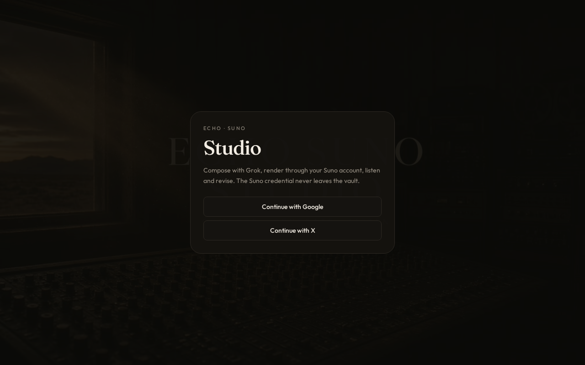

# Echo Music Studio

Private prompt-to-song workspace for **ECHO OMEGA PRIME**. Compose a concept, architect a spec, generate (Suno when a per-user vault key is present, otherwise a local sketch), then keep the result in library / projects / jobs.

Canonical repo: [https://github.com/echoomegaprime/echo-music-studio](https://github.com/echoomegaprime/echo-music-studio)



## Grok + GPT: the connector

This repo is the shared source. Each model uses a **different GitHub App**:

| Model | Connector | Action |
| --- | --- | --- |
| **Grok** | [Grok (by xAI)](https://github.com/apps/grok-by-xai) | Already installed on `echoomegaprime` |
| **ChatGPT / Codex** | [ChatGPT Codex Connector](https://github.com/apps/chatgpt-codex-connector) | Install: [new installation](https://github.com/apps/chatgpt-codex-connector/installations/new) — pick `echo-music-studio` |

Details: [docs/CONNECTORS.md](docs/CONNECTORS.md). Agent rules: [AGENTS.md](AGENTS.md). Shared skills: [echo-ai-skills](https://github.com/echoomegaprime/echo-ai-skills).

## Quickstart

```bash
git clone https://github.com/echoomegaprime/echo-music-studio.git
cd echo-music-studio
npm ci
npm run dev          # 0.0.0.0:8080
```

Sign in with email/password (local Better Auth). Open **Settings → Vault** to store a Suno Platform credential (encrypted at rest, never returned to the browser). Without a vault key, **Create** still runs a local sketch so the studio is usable.

Optional production DB:

```bash
cp .env.example .env
# DATABASE_URL=postgres://...
# BETTER_AUTH_SECRET=...
# BETTER_AUTH_URL=https://your-host
```

## Architecture

| Layer | Choice |
| --- | --- |
| UI | React 19 + TanStack Router / Start + Tailwind v4 |
| Auth | Better Auth, per-user gates |
| Data | PGLite in-process, or Neon/Postgres when `DATABASE_URL` is set |
| Jobs | Server functions in `src/lib/suno/` — generate, cover, extend, mashup, sketch |
| Vault | AES credential store in `src/lib/suno/vault.server.ts` |
| Architect | Optional in-app model for song specs; local fallback if no AI key |

See [docs/architecture.md](docs/architecture.md).

## Product rules

- No copyrighted lyrics or living-artist impersonation payloads
- No fake provider APIs
- Confirm-gated paid generations (`EXECUTE`)
- Vault credentials never leave the server

## Scripts

| Command | What |
| --- | --- |
| `npm run dev` | Vite on `0.0.0.0:8080` |
| `npm run typecheck` | `tsc --noEmit` |
| `npm test` | Node test runner on `scripts/**/*.test.mjs` |
| `npm run build` | Vite production build + migrations |

## Related (not this repo)

`echo-music-forge` inside [echo-omnipresence-runtime](https://github.com/echoomegaprime/echo-omnipresence-runtime) is a Python gateway. Keep it separate.

## License

Proprietary — Echo Prime Tech LLC. See [LICENSE](LICENSE).
